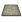
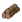
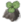

# pq-tools

Version: July 2026 – v5.0

---

## 🔧 Installation (Build 42 Official Tools)

Version 5 is a complete overhaul of the PQ Tools and has been tested with the official B42 tools.

Make sure you do not have any older PQ Tools installed.

Version 5 Tools are completely standalone, so you do not have to overwrite anything.

1. Put `LuaTools.txt` into your Tiled folder.
   - This `LuaTools.txt` contains only the PQ Tools. If you want to keep the vanilla Tiled tools for whatever reason, I have included a `LuaTools+Vanilla.txt`. Rename it to `LuaTools.txt` if you want to have the vanilla tools as well. I do not recommend it, because the PQ Tools already include everything the vanilla Tiled tools provide. The choice is yours.
2. Then copy all **pq-tools** Lua files from the **lua** folder into `Tiled/lua`.

---

## Key-Features

## Key Features

-  [Blends Tool](#blends-tool)
-  [Curb Plus Tool](#curb-plus-tool)
-  [Fence Plus Tool](#fence-plus-tool)
-  [Parking Stall Plus Tool](#parking-stall-plus-tool)
-  [Street Decoration Plus Tool](#street-decoration-plus-tool)
-  [Decoration Tool](#decoration-tool)
-  [Brush Tool](#brush-tool)

---

## Blends Tool

## Curb Plus Tool

## Fence Plus Tool

## Parking Stall Plus Tool

## Street Decoration Plus Tool

## Decoration Tool

## Brush Tool

---

Built with ❤️ and zero fluff,  

**Pabbiqo**

